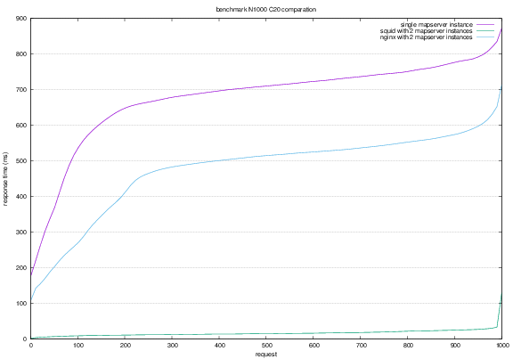

### Abplotting



#### Define a benchmark

`abplotting` is a simple tool for do the `benchmark` testing for web applications. By using `abplotting`, you can 
simply define your `benchmark` in a `yml` file like this:

```yml
benchmark:
  description: "Benchmark of WFS with/without cache"
  number: 1000
  concurrent: 20

  tests:
    - name: single instance
      description: single instance
      url: http://192.168.3.11:8080/resources

    - name: squid with 2 instances
      description: squid with 2 instances
      url: http://192.168.3.15:8080/resources
```

The `number` specific how many requests you want to send out for each site, and `concurrent` defines how many threads to simulating the real user. While the `description` used for generate the `title` for the final result.

In each item in `tests`, it specific a server location in `url`, and other meta data is used to make the final chart more readable.

And then run the ruby script `plot.rb`:

```sh
$ ruby plot.rb meta.yml
```

After this command running successfully, some new files will be generated automatically:

-  `plot-script.g`, the gnuplot script to generate the final result `eps`(or `png`)
-  `benchmark,sh`, the shell script to run all the tests and invoke `gnuplot` to plot


#### Requirements

-  [ab](https://httpd.apache.org/docs/2.2/programs/ab.html), Apache Benchmarking tool
-  [gnuplot](http://www.gnuplot.info/), Gnuplot is a portable command-line driven graphing utility

If you are using Mac OS X, it should be very easy to install(ab is shipping with Mac OS X itself):

```sh
$ brew install gnuplot
```

#### How it works

Actaully, the `abplotting` is a simple wrapper of `gnuplot` script, it simply translate the `yml` config into the gnuplot, and invoke the `generated` shell script.


